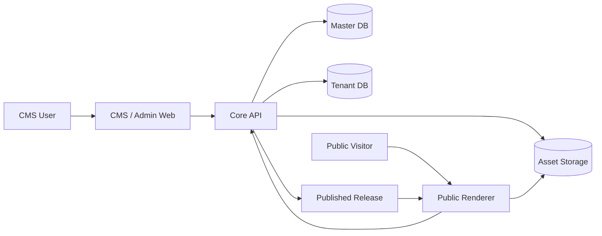
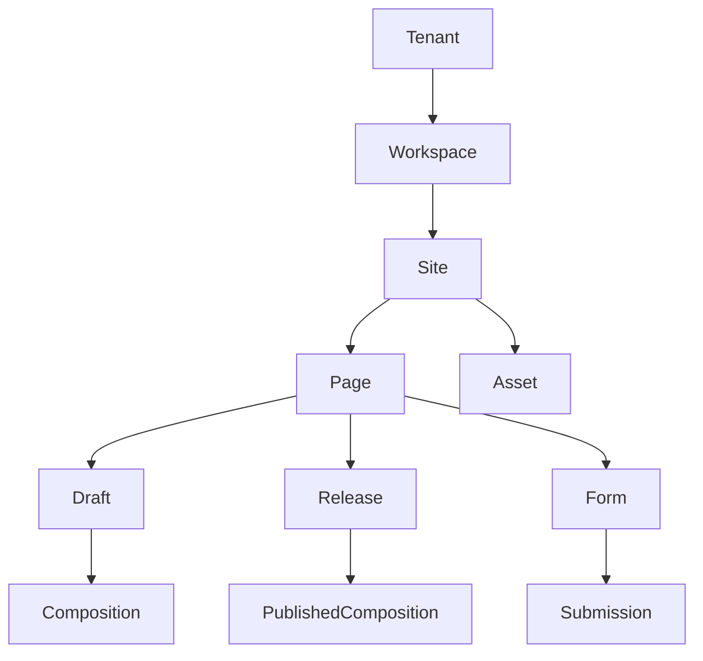
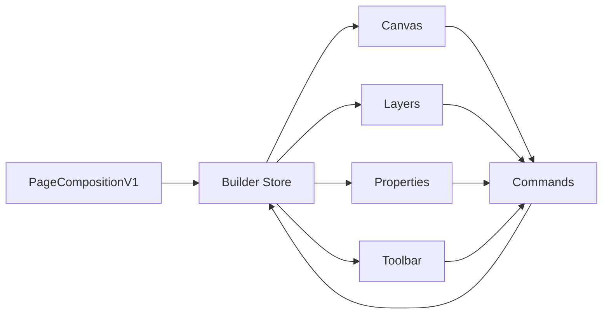
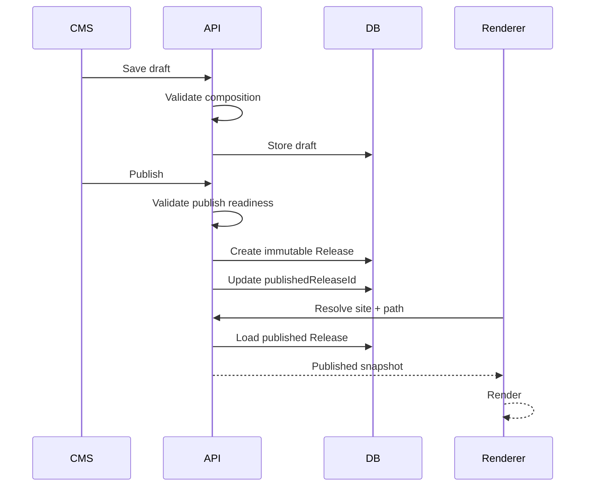
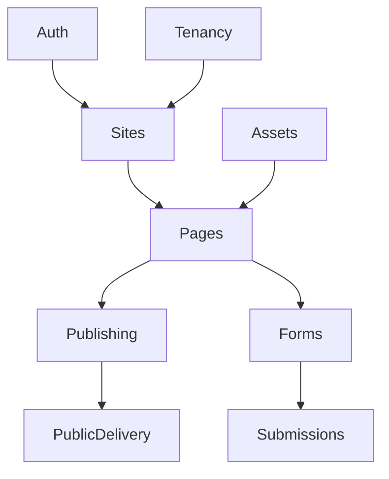

# Payload Landing Page Platform

## Architecture Rebaseline

**Status:** CANONICAL
**Version:** Rebaseline 1.0
**Date:** 2026-09-15
**Scope:** Architecture + product boundary + migration strategy + new development phases

```text
CURRENT_PHASE = PHASE 0A
```

---

# 1. Document Authority

Từ thời điểm rebaseline, tài liệu này là **nguồn sự thật duy nhất về kiến trúc và roadmap của hệ thống**.

This document is the canonical architecture and product source of truth.

Archived documentation is historical only.

When source code, archived documentation and this document conflict, this document
represents the target architecture.

Do not revive archived requirements without an explicit decision.

Canonical document:

```text
docs/ARCHITECTURE.md
```

Các tài liệu trước đây không bị xóa ngay, nhưng phải được chuyển thành historical archive:

```text
docs/
├── ARCHITECTURE.md
└── _archive/
    └── pre-rebaseline-2026-09-15/
        └── ... toàn bộ docs cũ ...
```

Quy tắc:

- Không dùng phase-1.md → phase-24.md để xác định requirement mới.
- Không dùng các handoff cũ làm roadmap.
- Không tiếp tục numbering phase cũ.
- Không lấy các architecture decision cũ làm mặc định.
- Code hiện tại là implementation reference, không phải specification.
- File trong _archive/ chỉ được đọc khi cần tìm lịch sử hoặc hiểu legacy code.
- Nếu tài liệu archive mâu thuẫn với ARCHITECTURE.md, tài liệu này luôn thắng.
- Mọi AI/agent làm việc với repository phải đọc docs/ARCHITECTURE.md trước khi thay đổi code.

---

# 2. Vì sao cần Rebaseline

Dự án khởi đầu là một nền tảng landing-page/page-builder nhưng scope hiện tại đã mở rộng thành một application platform khá lớn.

Repository hiện có:

```text
apps/
├── api
├── cms
└── renderer

packages/
├── contracts
└── cli
```

Cấu trúc monorepo và việc tách API / CMS / Renderer là nền móng hợp lý và nên giữ lại. Root workspace cũng đã có Turbo, TypeScript, Vitest và Playwright.

API hiện bao gồm auth, billing, bootstrap, common, config, domain, extensions, health, persistence, security, tenancy, testing và workflows. Trong domain hiện đồng thời có analytics, assets, collections, custom domains, integrations, layouts, navigation, organizations, pages, reusable components, SEO, sites, submissions, templates và workspaces.

Một số service lớn như page.service.ts, collection.service.ts, navigation.service.ts và site.service.ts cho thấy business responsibility đang tập trung quá nhiều vào một module/domain layer. CMS cũng đã có analytics, assets, audit, billing, collections, design system, domains, extensions, integrations và builder riêng; globals.css đã trở thành một file lớn.

Vấn đề chính:

1. Scope vượt quá nhu cầu xác thực sản phẩm.
2. Quá nhiều domain cùng phát triển.
3. Builder mang quá nhiều trách nhiệm.
4. Legacy và architecture mới cùng tồn tại.
5. Documentation không còn phản ánh đúng trạng thái code.
6. Chi phí thay đổi một feature ngày càng tăng.
7. Khó xác định đâu là core product và đâu là platform capability.

---

# 3. Current Architecture Assessment

## 3.1 Phần nên giữ

Giữ monorepo pnpm/Turbo/TypeScript với apps/api, apps/cms, apps/renderer và packages/contracts. Không rewrite repository từ zero.

Giữ API technology: NestJS, Mongoose, MongoDB, Zod và Pino. NestJS phù hợp với modular monolith và hệ thống đã có foundation đáng kể.

Giữ CMS Next.js và React. CMS hiện dùng Next.js 16 / React 19 và GrapesJS.

Giữ renderer độc lập. Public traffic và administrative traffic không nên buộc phải chạy chung lifecycle.

Giữ format, lint, typecheck, unit test, integration test, build verification và Playwright E2E. CI tiếp tục chạy MongoDB, formatting, lint, typecheck, tests, build và full browser tests.

---

# 4. Architectural Decision

Kiến trúc mới là:

> **Modular Monolith + Independent Public Renderer**

Không chuyển sang microservices. Không tạo thêm service nếu chưa có bottleneck thực tế.



Các deployment boundary hiện có vẫn được giữ: CMS, API và Renderer. Business architecture bên trong phải đơn giản hơn đáng kể.

---

# 5. Product Boundary

## 5.1 Product Vision

# Conversion Website Platform

Đây không chỉ là page builder, Webflow clone, CMS hay website agency tool.

Product vision:

> Một nền tảng giúp doanh nghiệp, marketer và agency tạo, vận hành và tối ưu website / landing page phục vụ marketing, campaign, lead generation và conversion mà không cần phụ thuộc vào developer trong các tác vụ thông thường.

Ba trụ cột:

```text
CREATE
OPERATE
CONVERT
```

CREATE gồm templates, guided builder, content editing và assets.

OPERATE gồm site, pages, preview, publish, domain, release và SEO.

CONVERT gồm forms, submissions, leads, campaigns, analytics, integrations và automation về sau.

## 5.2 Initial Target Users

Ưu tiên:

1. Freelancer / small agency quản lý nhiều site / khách hàng.
2. Marketing team trong SME cần tạo campaign và landing page mà không phụ thuộc developer.
3. Business owner cần guided/simple editing thay vì advanced builder.

Không thiết kế hệ thống ngay từ đầu cho enterprise.

## 5.3 Product Principles

```text
1. Build the product before building the platform.
2. User outcome is more important than feature count.
3. Prevent invalid states instead of validating them afterward.
4. One source of truth for application state.
5. One official editor for one property.
6. Prefer explicit architecture over clever abstraction.
7. No speculative feature development.
8. No enterprise complexity without validated demand.
9. Existing code is not automatically correct architecture.
10. Legacy compatibility must be intentional, not automatic.
11. Simplicity > generic extensibility during early product stages.
12. A feature is not complete until its end-to-end user journey works.
```

## 5.4 Core Product

Flow thị trường đầu tiên:

```text
Create Site
    ↓
Create Page
    ↓
Build Page
    ↓
Preview
    ↓
Publish
    ↓
Receive Leads
```

Core capability:

```text
Authentication
Tenant context
Site management
Page management
Visual page builder
Asset management
Preview
Publishing
Public rendering
Basic SEO
Forms
Submissions / Leads
Basic notification
```

Đây là product. Những thứ còn lại là platform expansion.

---

# 6. Active and Deferred Domain Boundaries

## 6.1 Core Product (Active)

The active product boundary is intentionally limited to:

```text
auth
tenancy
workspace
sites
pages
composition
assets
templates
publishing
renderer/public-delivery
forms
submissions
leads
seo-basic
```

These modules may still depend on shared infrastructure, but they must not
depend on frozen platform capabilities without an explicit architecture decision.

## 6.2 Frozen / Deferred Capabilities

Các subsystem sau không được tiếp tục mở rộng trong các phase core:

```text
Billing
Advanced Analytics
Workflow engine
Extension marketplace/platform
Collections / dynamic CMS
Advanced integrations
Advanced RBAC
Audit UI
Reusable component platform
Custom design-system editor
Template marketplace
CLI product
Advanced collaboration
Automation
CRM
Social integrations
Complex organization hierarchy
```

Không nhất thiết xóa code ngay. Nguyên tắc là: **Freeze, isolate, remove from active product surface.** Không dành thời gian sửa chúng nếu chúng không chặn core flow.

---

# 7. Core Domain Model



Core entities:

- Tenant: công ty/customer boundary.
- Workspace: logical workspace bên trong tenant; MVP có thể chỉ có một default workspace.
- Site: website/project, chịu trách nhiệm name, slug, homepage, navigation, basic branding và domain mapping.
- Page: route/page với id, siteId, name, slug/path, status, SEO, draftVersion và publishedReleaseId.
- Composition: content/layout của page và là single source of truth của Builder.
- Release: immutable snapshot được tạo khi publish; Renderer chỉ render Release.
- Asset: metadata + storage reference cho image, video, document và icon.
- Submission: lead/form result; không nhúng submission vào Page model.

---

# 8. Canonical Page Model

Đây là thay đổi kiến trúc quan trọng nhất.

Open Composition hiện tồn tại song song với các legacy PagePayload versions. Điều này phù hợp với migration lịch sử nhưng không phù hợp nếu tiếp tục phát triển sản phẩm theo kiến trúc mới.

Authoring model mới chỉ có:

```text
PageCompositionV1
```

Nó là CMS source of truth, Builder source of truth, API validation source of truth, Preview source of truth và Publish source.

Không duy trì các nguồn độc lập như Builder state, Properties state, GrapesJS state và Payload state rồi cố đồng bộ chúng.

---

# 9. Builder Architecture

Builder là phần rủi ro cao nhất. Builder mới phải có một store duy nhất và mọi thay đổi phải đi qua command.



Commands tối thiểu:

```text
insertNode
deleteNode
moveNode
updateProps
updateStyle
duplicateNode
changeLayout
```

Canvas, Layers và Properties không giữ business state độc lập. UI phải ngăn invalid state: drop target không hợp lệ bị disable hoặc component chỉ xuất hiện ở vị trí hợp lệ.

Properties panel được tạo từ schema/component definition. Mỗi property có một editor chính thức; các UI khác chỉ gọi cùng command/store nếu cần hiển thị shortcut.

Nếu tiếp tục giữ GrapesJS:

```text
GrapesJS = Canvas Adapter
```

GrapesJS không phải Persistence, Page schema hay Business state. Có thể thay GrapesJS sau này mà không thay API/Page model.

---

# 10. Page Composition Contract

```ts
type PageCompositionV1 = {
  version: 1;
  root: Node;
  settings: PageSettings;
};

type Node = {
  id: string;
  type: ComponentType;
  props: Record<string, unknown>;
  style?: StyleDefinition;
  children?: Node[];
};
```

Component registry chịu trách nhiệm về allowed parents, allowed children, properties, default props, property editor, responsive support, runtime renderer và builder renderer. Không hard-code rule ở nhiều nơi.

---

# 11. Publishing Architecture

Draft và Published content phải tách biệt hoàn toàn.



Release immutable. Rollback chỉ đổi publishedReleaseId sang Release cũ; không editing Release trực tiếp.

---

# 12. Renderer Boundary

Renderer chỉ cần route, release, assets, SEO và runtime behaviors. Renderer không import CMS editor state, GrapesJS state, drag/drop metadata, properties editor hoặc builder command.

Renderer phải có thể tồn tại nếu CMS hoàn toàn offline.

---

# 13. API Architecture

Không tiếp tục DomainModule theo kiểu chứa gần như toàn bộ product.

Target:

```text
apps/api/src/modules/
├── auth/
├── tenancy/
├── sites/
├── pages/
├── assets/
├── publishing/
├── forms/
├── submissions/
├── public-delivery/
└── shared/
```



Không cho Pages phụ thuộc Billing, Analytics, Workflow hoặc ExtensionPlatform. Core domain không phụ thuộc optional feature; optional feature chỉ được phụ thuộc core.

---

# 14. Contracts Architecture

packages/contracts/src/index.ts hiện là permission/contract surface quá rộng. Không tiếp tục phát triển một god-file.

Target:

```text
packages/contracts/src/
├── auth/
├── tenant/
├── site/
├── page/
├── composition/
├── asset/
├── publish/
├── form/
├── submission/
├── public/
└── index.ts
```

index.ts chỉ re-export. Business schema nằm trong module tương ứng.

---

# 15. Tenancy

Giữ database-per-tenant foundation và global Tenant Resolution Middleware; không rewrite tenancy ngay.

```text
Master DB
    ↓
Tenant Registry
    ↓
Tenant DB
```

Master DB chỉ quản lý tenant identity, database mapping, tenant lifecycle và system-level metadata. Tenant DB quản lý workspace, site, page, assets, releases, forms và submissions.

Trong core: giữ infrastructure; không thêm advanced organization model, tenant billing, cross-tenant collaboration hoặc control plane ngoài provisioning cơ bản.

---

# 16. Asset Architecture

Application chỉ lưu asset metadata. Binary storage dùng abstraction:

```text
AssetStorage
├── LocalStorage
└── ObjectStorage
```

Development dùng local filesystem; production dùng S3-compatible object storage. Page composition chỉ lưu assetId, không lưu binary/blob.

---

# 17. Forms and Leads

Forms là conversion capability của product.

```text
Visitor → Form → Submission API → Validation / spam protection
        → Submission → Lead → Notification
```

MVP notification chỉ cần Email và Webhook. Không dùng workflow engine để gửi notification.

---

# 18. SEO

Core SEO gồm title, description, favicon, Open Graph image, canonical và index/noindex. Sitemap và robots có thể tạo từ Site/Page metadata. Không xây SEO platform phức tạp.

---

# 19. Analytics

Không xây first-party analytics platform trong core rebaseline. Ban đầu chỉ support GA4, Google Tag Manager, Meta Pixel và custom script slot có kiểm soát. First-party analytics hiện có được đóng băng cho tới khi có business requirement đã được chứng minh.

---

# 20. Billing

Billing không phải dependency của Page domain. Trong giai đoạn validate product, manual subscription, admin assignment và feature flag là đủ. Billing engine hiện tại được freeze cho tới khi có khách hàng cần automated subscription.

---

# 21. Extensions and Workflows

Extension/workflow không tác động trực tiếp vào core model.

```text
Core Event
    ↓
Event Bus
    ↓
Optional Capability
```

Các event tương lai có thể gồm submission.created, page.published và site.created. Core không gọi WorkflowEngine.

---

# 22. Repository Target

Không restructure repository quá mạnh trong Phase 0. Target dài hạn:

```text
apps/
├── api/src/modules/{auth,tenancy,sites,pages,assets,publishing,forms,submissions,public-delivery}
├── api/src/shared/
├── cms/app/
├── cms/builder/{core,canvas,layers,properties,commands,components}
└── renderer/

packages/
└── contracts/src/{auth,site,page,composition,asset,publish,form,submission}

docs/
├── ARCHITECTURE.md
└── _archive/
```

---

# 23. Code Disposition

| Area                                                   | Decision                  |
| ------------------------------------------------------ | ------------------------- |
| pnpm/Turbo monorepo                                    | KEEP                      |
| NestJS API                                             | KEEP                      |
| Next.js CMS                                            | KEEP                      |
| Renderer app                                           | KEEP                      |
| MongoDB/Mongoose                                       | KEEP                      |
| Playwright/Vitest                                      | KEEP                      |
| DB-per-tenant infrastructure                           | KEEP + FREEZE             |
| Open Composition concepts                              | KEEP + SIMPLIFY           |
| DomainModule                                           | REFACTOR                  |
| giant domain services                                  | REFACTOR                  |
| contracts god-file                                     | REFACTOR                  |
| Builder state architecture                             | REBUILD internally        |
| GrapesJS                                               | KEEP AS ADAPTER initially |
| PagePayload legacy versions                            | COMPATIBILITY ONLY        |
| Analytics, Billing, Extensions, Workflows, Collections | FREEZE                    |
| Advanced integrations, Audit UI, CLI                   | FREEZE                    |
| Legacy docs                                            | ARCHIVE                   |

---

# 24. Legacy Code Policy

Không xóa hàng loạt legacy code trong lần đầu.

```text
KEEP      nếu core đang sử dụng ổn định
REFACTOR  nếu core cần nhưng boundary sai
FREEZE    nếu không cần cho MVP nhưng có thể dùng sau
DELETE    chỉ khi không còn dependency + test xác nhận
```

Không thực hiện Big Bang Rewrite.

---

# 25. Legacy Payload Policy

Existing payloads gồm PagePayload V1 đến PagePayload V8 / Open Composition. Target authoring chỉ có PageCompositionV1. Legacy parsers chỉ tồn tại trong compatibility boundary; Builder mới không được tạo legacy payload.

Nếu chưa có production customer data cần migration, không mang historical schema debt sang architecture mới chỉ để duy trì compatibility với test/development data. Trước khi xóa parser cũ phải xác nhận repository không có dữ liệu production cần migrate.

---

# 26. New Development Phases

Phase numbering được reset. Các phase cũ không còn active roadmap.

## PHASE 0 — Rebaseline & Governance

Mục tiêu là establish documentation, architecture, AI rules, baseline,
dependency classification và quality gates. Phase 0A là nhiệm vụ governance
foundation hiện tại. Phase 0B là final codebase rebaseline trước khi bắt đầu
feature development.

### PHASE 0A — AI Governance & Documentation Foundation

Hoàn thiện canonical documentation, archive historical docs, root agent rules,
source-of-truth pointers, dependency classification, quality gates, PR workflow
và automated governance checks. Không feature coding.

Exit gate: một architecture document, một active roadmap, một bộ AI rules
discoverable từ root và không còn ambiguity giữa docs cũ và mới.

### PHASE 0B — Final Codebase Rebaseline

Đối chiếu implementation với architecture, chốt active/deferred dependency graph,
xác nhận production-data compatibility requirement và ghi nhận các blocker còn
lại. Không refactor diện rộng và không mở feature mới.

Exit gate: baseline code/test/dependency report được owner xác nhận và mọi blocker
được xử lý hoặc ghi nhận rõ trước Phase 1.

## PHASE 1 — Core Product Simplification

Simplify active product surface, isolate frozen modules, reduce unnecessary
coupling và stabilize core. Không redesign Builder trong phase này.

Exit gate: core modules build độc lập và frozen modules không ảnh hưởng core flow.

## PHASE 2 — Canonical Content Engine

Xây Site, Page, PageCompositionV1, Draft, Release và contract boundaries với one
schema, one validation path và one persistence model. Legacy payload chỉ còn
compatibility layer.

Exit gate: CRUD site/page, save/load/validate composition và immutable release.

## PHASE 3 — Guided Builder

Xây canonical Builder Store, commands, component registry, Canvas, Layers,
Properties, undo/redo, responsive editing và strict synchronization. User không
cần biết code và không tạo được invalid structure qua UI thông thường.

Exit gate: tạo landing page hoàn chỉnh với Canvas, Layers và Properties dùng cùng
một store.

## PHASE 4 — Templates & Fast Creation

Xây template system, starter flows, structured page creation và business
information-driven setup.

## PHASE 5 — Publishing & Delivery

Hoàn thiện preview, release, publish, rollback, renderer, routing, SEO và domain.

Exit gate: Create → Build → Preview → Publish end-to-end.

## PHASE 6 — Leads & Conversion

Hoàn thiện forms, submissions, leads, notification và conversion dashboard.

## PHASE 7 — Campaign Operations

Xây campaigns, duplication, campaign pages và operational workflows.

## PHASE 8 — Integrations & Automation

Chỉ mở sau khi usage xác nhận demand.

## PHASE 9 — Analytics & Optimization

Tập trung business/conversion analytics sau khi core product có evidence.

## PHASE 10 — Monetization

Xây plans, usage, billing và agency model khi có nhu cầu đã được chứng minh.

## PHASE 11+ — Validated Expansion

Chỉ mở rộng theo architecture proposal riêng cho AI, advanced workflow, CRM,
A/B testing, personalization, marketplace và advanced collaboration.

---

# 27. Phase Gate Rule

Không bắt đầu phase tiếp theo chỉ vì code phase hiện tại đã merge. Phase chỉ complete khi Architecture satisfied, Tests pass, E2E core flow pass, không có critical state duplication, không có undocumented dependency và không có known blocker bị chuyển tiếp âm thầm.

Nếu còn blocker, phase remains open. Không tạo Phase X.1, X.2, X.3 chỉ để vá liên tục.

---

# 28. Documentation Policy Sau Rebaseline

Active documentation tối đa:

```text
docs/ARCHITECTURE.md
```

Trong rebaseline đầu tiên không tạo phase-x.md, handoff-x.md, phase-x-completion.md, phase-x-audit.md hoặc summary-x.md. Progress quản lý bằng Git commits, GitHub issues và PR descriptions. Chỉ sửa ARCHITECTURE.md khi architecture decision thực sự thay đổi.

---

# 29. AI Agent Rule

Mọi coding agent phải nhận instruction:

```text
Read docs/ARCHITECTURE.md first.
Do not use docs/_archive/** as current requirements.
Do not revive frozen modules unless explicitly requested.
Do not introduce a new abstraction unless required by the current phase.
Do not preserve legacy compatibility automatically.
Do not add features outside the active phase.
Prefer deleting unnecessary complexity over extending it.
Core product stability has priority over platform extensibility.
```

---

# 30. Definition of Done trước khi Coding Lại

Không bắt đầu Phase 1 trước khi hoàn thành:

```text
[ ] current main tagged as pre-rebaseline baseline
[ ] current docs moved to docs/_archive/pre-rebaseline-2026-09-15
[ ] docs/ARCHITECTURE.md installed
[ ] old phase roadmap declared inactive
[ ] current build/test status recorded
[ ] active modules identified
[ ] deferred modules identified
[ ] dependency graph checked
[ ] production-data compatibility requirement confirmed
[ ] new rebaseline development branch created
```

---

# 31. Change Control

Một task bình thường tuân theo:

```text
requirement
    → inspect architecture
    → implementation
    → tests
```

Nếu requirement làm thay đổi hoặc conflict với architecture:

```text
requirement
    → identify architecture conflict/change
    → update decision
    → update architecture
    → implementation
    → migration if needed
    → tests
```

Không được implement trước rồi âm thầm sửa architecture document để hợp thức
hóa code. Architecture change phải có explicit reason và consequences.

## Architecture Decision Log

### ADR-001

```text
Date: 2026-09-15
Status: Accepted
Decision: Use a modular monolith rather than microservices.
Reason: The core product needs clear boundaries and low operational complexity;
       no measured bottleneck justifies service decomposition.
Consequences: API modules must have explicit dependency direction, while CMS,
              API and Renderer remain separate deployment boundaries.
```

### ADR-002

```text
Date: 2026-09-15
Status: Accepted
Decision: PageCompositionV1 is the canonical authoring model.
Reason: Builder, validation, preview and publishing need one content source of truth.
Consequences: Legacy PagePayload versions remain compatibility-only and may not
              become new Builder persistence formats.
```

### ADR-003

```text
Date: 2026-09-15
Status: Accepted
Decision: GrapesJS is a canvas adapter only.
Reason: Editor internals must not define the domain, persistence or public delivery model.
Consequences: Builder integration is replaceable and all business mutations use
              the canonical Builder Store and commands.
```

### ADR-004

```text
Date: 2026-09-15
Status: Accepted
Decision: Archived documentation is historical, not normative.
Reason: Previous phase and handoff documents conflict with the rebaseline scope.
Consequences: New requirements must use this document; archived documents are read
              only for historical context or legacy investigation.
```

---

# 32. Final Architecture Principle

> Build a good landing-page product before building a platform.

Thứ tự ưu tiên:

```text
Correctness
↓
Usability
↓
Stability
↓
Maintainability
↓
Launchability
↓
Extensibility
```

Mục tiêu không phải hỗ trợ mọi feature có thể tưởng tượng trong tương lai, mà là một core đủ nhỏ để hiểu, đủ ổn định để vận hành và đủ linh hoạt để mở rộng sau khi thị trường chứng minh cần mở rộng.

---

# 33. Phase 0 Baseline Snapshot

Snapshot ghi nhận ngày 2026-09-15 trên commit 3af4468 (origin/main) trước thay đổi rebaseline. Đây là implementation baseline, không thay thế architecture decisions ở trên.

## Toolchain

```text
Node.js: v22.19.0 (workspace requires >=24.0.0)
.nvmrc: 24.19.0
pnpm: 10.15.0
```

corepack pnpm install --frozen-lockfile hoàn tất thành công.

## Verification

corepack pnpm verify hoàn tất thành công:

```text
format:check                 PASS
lint                         PASS
typecheck                    PASS
check:cms-design-system      PASS
unit tests                   PASS (98 passed, 12 skipped)
build                        PASS
```

Các integration test cần MongoDB không chạy trong verify mặc định vì RUN_MONGO_TESTS không được bật.

Full Playwright E2E chưa chạy: worktree không có .env và không có MongoDB container đang chạy. Cần Node 24, cấu hình môi trường và MongoDB trước khi chạy pnpm test:e2e hoặc pnpm test:e2e:full.

## Current boundary check

Repository evidence xác nhận core capability cần giữ là authentication, tenancy, sites, pages, assets, publishing/public delivery, forms và submissions. Current DomainModule vẫn import billing, extensions, workflows, analytics, navigation, collections, templates, reusables, integrations và organization concerns; đây là dependency debt để xử lý trong Phase 1, không phải target architecture.

packages/contracts/src/index.ts vẫn là aggregate contract surface và exports legacy PagePayloadV1–PagePayloadV8; đây là compatibility/reference state để xử lý trong Phase 2.

## Production-data compatibility

Không có production database inventory, customer-data declaration hoặc migration approval nào trong repository. Vì vậy Phase 0 không xóa parser, không chạy destructive migration và không thay đổi legacy persistence. Trước khi loại bỏ compatibility boundary, owner/operator phải xác nhận có hay không dữ liệu production cần migrate.

Active/deferred module disposition được xác lập ở Sections 5, 6 và 23; dependency graph target được xác lập ở Sections 13–14. Branch làm việc hiện tại là ao/cms-9/root, một branch không phải default branch do session tạo từ main cho rebaseline work.
