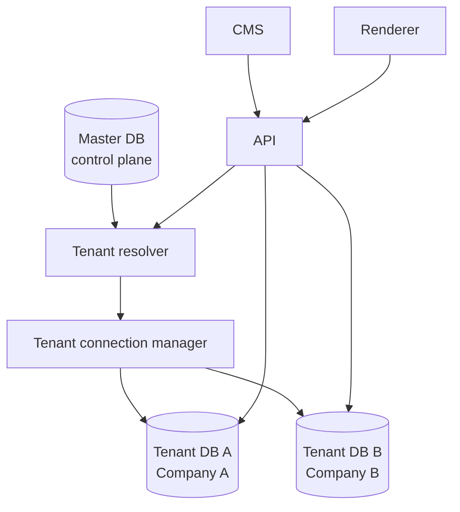
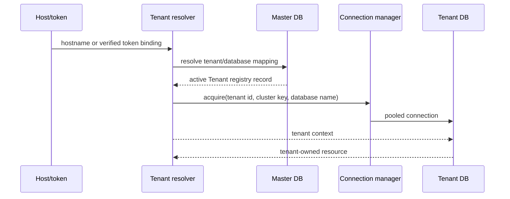
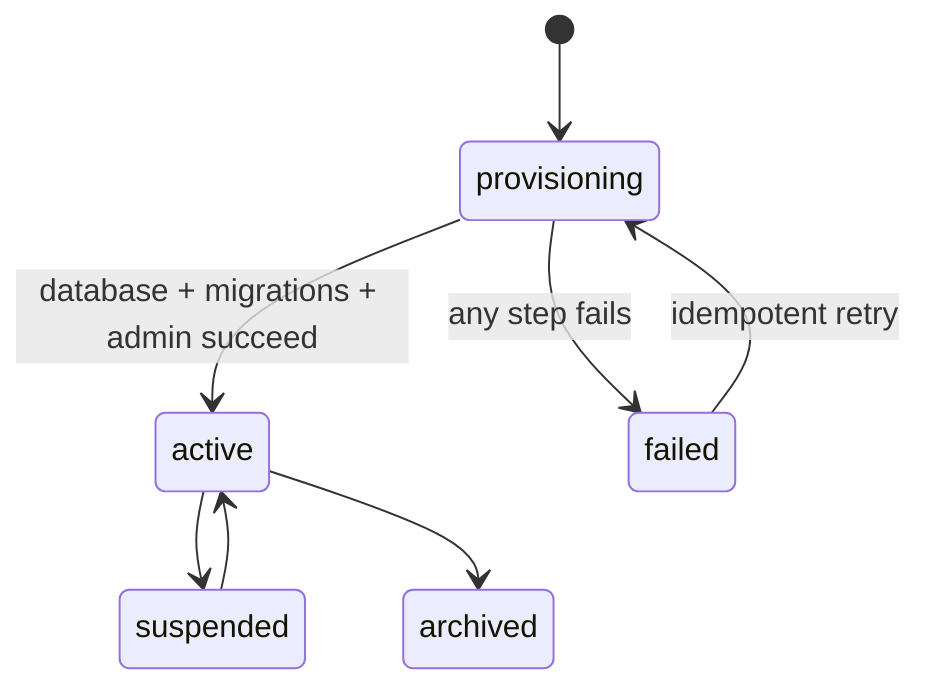

# Phase 10 — Tenant Control Plane and Database-per-Tenant Architecture

## Status

Phase 10 establishes `Tenant = Company` and moves tenant isolation to the MongoDB
database boundary. The Master DB is a control plane; tenant databases are data planes.
Phase 11 billing, plans, quotas and usage foundation is documented separately in
[`docs/phase-11.md`](phase-11.md). Advanced RBAC and audit logs remain future work.

## Current-state audit

The Phase 1–9 repository is a NestJS modular monolith (`apps/api`), a Next.js CMS
(`apps/cms`) and an independent Next.js renderer (`apps/renderer`). MongoDB is reached
through one default `MongooseModule.forRoot` connection. Domain services receive
singleton `@InjectModel` models and every resource query includes `workspaceId`.

Before this phase, the uncommitted Phase 9/10 work added `Organization` and
`OrganizationMembership` collections to that same database. That model is not the
tenant boundary and is being replaced by the control-plane registry below. The
resource collections, published-version pointer, custom-domain verification and SEO
records remain the Phase 1–9 data model, except that their database is now selected by
tenant context.

Important invariants found during the audit:

- `PagePayloadV1` and `PagePayloadV2` are serializable rendering contracts. They do not
  contain ownership or database metadata and remain frozen.
- `Workspace` remains the logical subdivision inside a company. Sites, pages, page
  versions, forms, leads, integrations, analytics, domains and SEO are workspace-owned
  records inside the tenant database.
- Public delivery uses the published version pointer only. Draft versions are never
  selected by public resolvers.
- The renderer and CMS call the API and never connect to MongoDB directly.
- Domain hostnames are normalized and custom-domain resolution is fail-closed.

## Target topology



### Master DB: control plane only

The Master DB contains global metadata required to find and operate a tenant:

- `Tenant`: `id`, company `name`, globally unique `slug`, lifecycle `status`,
  `databaseKey`, `databaseName`, optional `clusterKey`, non-secret
  `credentialReference`, `schemaVersion`, and timestamps.
- `TenantDatabase` data is represented by the database fields on `Tenant` in the first
  implementation. The model is intentionally shaped so it can become a separate
  registry without changing the tenant domain.
- `TenantDomain`: normalized hostname to tenant mapping for public and CMS resolution.
  Tenant-owned domain configuration remains in the tenant database and is checked
  again after the mapping lookup.
- Provisioning/migration state and schema versions.
- `PlatformUser`: Master DB platform-admin identities used by control-plane routes.

The Master DB does not contain pages, page payloads, submissions, integration secrets,
analytics events, leads or other tenant business records. A cluster URI is kept in an
environment/secret manager. The registry stores `clusterKey` and
`credentialReference`, never a plaintext connection string.

### Tenant DB: data plane

Each company receives one MongoDB database. It contains its own users and sessions,
workspace, sites, pages, page versions, assets, templates, forms/leads,
integrations/deliveries, analytics, custom domains and SEO settings. Existing
`workspaceId` ownership remains useful inside this database; no `tenantId` is added to
each record and no tenant metadata is added to a page payload.

## Tenant resolution

Resolution is server-side and fail-closed:

1. An authenticated token carries a tenant binding (`tid`). The API verifies the
   signature, loads that tenant from Master DB, rejects a non-active tenant, then
   loads the session and tenant models from that tenant database.
2. CMS login resolves a tenant from a configured tenant hostname or an explicit
   server-validated tenant slug hint. The hint selects a Master DB record; credentials
   are then checked against that tenant's user collection. It is never accepted as a
   database name or connection URI.
3. Custom public hosts first query the Master `TenantDomain` registry. The tenant
   database is then selected and the tenant-domain record, workspace/page binding and
   published version are validated again.
4. Platform path routes use the configured platform tenant mapping in development and
   a platform hostname mapping in production. Unknown or missing mappings return a
   generic not-found response. There is no default-tenant fallback.

The request-scoped tenant is held in `AsyncLocalStorage`, not a process-global current
tenant variable. Dynamic model proxies resolve the model from that context for every
operation. Concurrent requests for different tenants therefore cannot mutate or reuse
one another's model connection.



## Authentication and CMS

Tenant users and sessions live in the tenant database. The access token contains a
tenant id solely as a signed routing binding; it is not a user-provided authority.
The session is still checked in the tenant database on every authenticated request.
Suspended, provisioning, failed and archived tenants cannot authenticate or serve
public content.

The CMS learns the tenant before or during login from the host/configured tenant
mapping or an explicit tenant slug. After login the response exposes tenant name and
workspace context. Changing workspace does not change the database. Changing tenant
creates a new tenant-local session and rotates the cookies; the CMS clears
tenant-sensitive UI state before reload.

The existing configured development credential is migrated into a tenant-local user
record using a Node `scrypt` password hash. This preserves local bootstrap behavior
without making the Master DB a user/business-data store. A future user directory and
invitation flow can replace this compatibility credential without changing tenant
resolution.

## API and model binding

Control-plane services use named Master DB models. Tenant domain services use dynamic
models backed by the `TenantConnectionManager`; the existing service methods and
workspace filters remain unchanged. A tenant model is registered once per connection
and never on the default/global Mongoose connection. Tenant users, sessions and
memberships are tenant-local; a signed token must resolve to an active tenant and an
active tenant-local membership before a session is issued.

The manager caches connections by `{clusterKey, databaseName}`. It uses bounded
connection options, coalesces concurrent opens, evicts idle/old entries
opportunistically, and has an explicit close lifecycle. The cache bound and idle TTL
are environment-configured so the policy can evolve without changing domain services.
One HTTP request never creates a new connection.

No `mongoose.model`, global model singleton, mutable environment tenant or default
database fallback is permitted. Missing tenant context causes a controlled error.

## Provisioning



Creating a tenant is an idempotent control-plane operation:

1. Reserve the globally unique slug and database name in Master DB.
2. Create/acquire the tenant database connection.
3. Run the registered tenant schema migrations in order.
4. Create the first tenant user and workspace only if absent.
5. Register configured platform/domain mappings.
6. Mark the tenant `active` only after every step succeeds.

On failure, the tenant remains `failed`, no request may use it, and a retry resumes
from the recorded schema/provisioning state. A failure for Tenant A does not close or
crash healthy Tenant B connections.

## Existing Phase 1–9 migration

The pre-Phase 10 database is treated as the first tenant data plane. Its database name
and resource ids remain unchanged; a Master `Tenant` record maps the legacy database
to the configured initial company. This is the safest migration because the old
resource records already have correct workspace ownership and published pointers.

The migration is idempotent and records a schema version. It does not infer users from
resource records. The configured development principal becomes the first tenant-local
user. Existing custom-domain records are copied into Master `TenantDomain` lookup
records; the tenant-domain records remain authoritative for page binding and active
status. Legacy organization collections are not used for authorization or routing and
are outside the new domain model; cleanup/archival is a separate explicit operational
step rather than an implicit destructive bootstrap action.

New tenants receive a fresh database and the same migration runner. If one migration
fails, only that tenant is marked failed. The Master registry remains available for
other tenants.

## Domains, forms, analytics and SEO

The Master domain registry supplies `hostname → tenant`. The tenant database remains
the source of truth for whether that host is verified, active, assigned to a page and
allowed to serve. The renderer never trusts a browser-provided tenant id.

Public responses may carry a small routing context outside the page payload so the
renderer can send form and analytics events back to the same tenant. This context is
not persisted in `PagePayloadV1/V2` and is validated by the API against the Master
registry. Public page, form, lead, integration, analytics, SEO, robots and sitemap
reads all execute inside the resolved tenant context.

## Cache and failure isolation

Phase 10 keeps the existing correctness-first `no-store` renderer reads and does not
introduce Redis/CDN caching. If a cache is added later, every key must include the
tenant id (and host/workspace/page dimensions where relevant).

- Master DB outage: new resolution/provisioning fails closed; the API never guesses a
  tenant. Existing cached connections are not treated as an authority.
- Tenant A DB outage: A returns a tenant-scoped degraded/unavailable response; Tenant B
  continues if its connection and Master DB are healthy.
- Unknown host: generic not-found; no database connection is attempted.

## Security review answers

| Question                               | Decision                                                                                        |
| -------------------------------------- | ----------------------------------------------------------------------------------------------- |
| CMS tenant before login?               | Host/configured mapping resolves Master `Tenant`; credentials are checked in that tenant DB.    |
| Where are users?                       | Tenant users and memberships are tenant-local; platform-admin identities are Master DB records. |
| How does API select DB?                | Verified token `tid` → Master tenant lookup → AsyncLocalStorage context → manager.              |
| How does Renderer resolve custom host? | Master `TenantDomain` lookup, then tenant-domain/page/published checks.                         |
| How are models bound?                  | Per-tenant connection registry; no global Mongoose model.                                       |
| Can identical slugs/IDs exist?         | Yes across databases; IDs are only interpreted inside the resolved tenant.                      |
| How are caches isolated?               | No shared cache in Phase 10; future keys must include tenant id.                                |
| What if tenant is unknown/offline?     | Fail closed; no default tenant and no cross-tenant retry.                                       |
| How is isolation tested?               | Same IDs/slugs in two tenant DBs, concurrent requests, token mismatch and domain lookup tests.  |

## Actual module plan

The implementation follows the repository's existing `apps/api/src` convention:

```text
apps/api/src/tenancy/
  master-connection.ts
  tenant-context.ts
  tenant-connection.manager.ts
  tenant-model.registry.ts
  tenant-resolver.ts
  tenant-provisioning.service.ts
  schemas/tenant.schema.ts
  schemas/tenant-domain.schema.ts
  schemas/tenant-user.schema.ts
  schemas/tenant-membership.schema.ts
  schemas/platform-user.schema.ts

apps/api/src/bootstrap/
  tenant-bootstrap.module.ts
  tenant-bootstrap.service.ts

apps/api/src/persistence/schemas/   # existing tenant schemas, dynamic registration
packages/contracts/src/index.ts     # tenant routing metadata only; payload unchanged
apps/cms/                            # host/tenant-aware login/context display
apps/renderer/                       # host resolution and tenant routing metadata
```

## Scope boundary

This phase did not add billing, plans, subscriptions, quotas, invoices, advanced
RBAC, invitation email delivery, a distributed cache, dedicated-cluster provisioning,
or microservices. `clusterKey` and secret references are registry seams for a future
enterprise deployment, not a request to build that infrastructure now.

## Phase 10 hotfix — request settling

The first browser trace for the CMS showed two concurrent bootstrap executions in the
development runtime. React StrictMode exposed the non-idempotent effect, but it was
not the source of an unbounded loop: both executions completed with 200 responses and
no further bootstrap requests were emitted. The CMS API client now coalesces only
concurrent GETs by path and removes the entry when the request settles. Completed
responses are not cached, mutations are not coalesced, and the one-refresh auth
policy remains finite. Redundant `router.refresh()` calls after `router.replace()`
were also removed.

A follow-up trace with stale access and refresh cookies exposed the actual redirect
loop: `/login → proxy sees cookie → / → auth/me 401 → refresh 401 → /login`, after
which the proxy treated the stale cookie as a valid session and repeated the cycle.
The CMS proxy no longer redirects `/login` to `/` based on cookie presence. Login is
now the terminal recovery route; the API client remains responsible for validating
and clearing the session. This avoids treating an unverified cookie as authentication.

The Renderer trace showed two API calls for one public page request, with distinct API
request IDs: one from `generateMetadata()` and one from the page render. This was a
bounded duplicate, not Renderer → API → Renderer recursion. Public page, custom-domain
page and preview reads now use React request memoization, so metadata and page rendering
share the same in-flight read while preserving `no-store` behavior between requests.

The invariant is therefore:

```text
CMS mount → finite bootstrap GETs → settled UI
Renderer request → one server-side public read → metadata/render response
```

Tenant resolution remains one-way: Renderer → API → Master domain lookup → tenant DB.
No API path calls the Renderer, and control-plane lookup does not require tenant auth.
