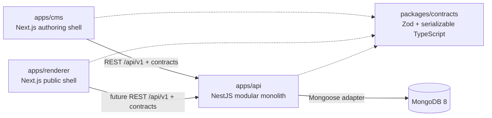

# Phase 1 — Foundation & Architecture

## Scope

This is a greenfield foundation. The repository contains three independently deployable
application boundaries and one small shared contract package. No Phase 2 page domain is
implemented.

## Architecture map

`packages/contracts` is compile-time/runtime contract sharing only. It cannot import
NestJS, Next.js, React, Mongoose or editor libraries. CMS and renderer do not connect to
MongoDB or import API internals.

## Stack decisions

| Concern   | Decision                    | Boundary rule                                        |
| --------- | --------------------------- | ---------------------------------------------------- |
| Runtime   | Node.js 24 LTS              | Enforced by `engines` and `.nvmrc`                   |
| Monorepo  | pnpm workspaces + Turborepo | One task graph, explicit packages                    |
| Frontends | Next.js 16 + React 19       | CMS and renderer are separate applications           |
| API       | NestJS 11 + Express         | One modular monolith, REST under `/api/v1`           |
| Database  | MongoDB 8 + Mongoose        | Persistence stays inside the API                     |
| Contracts | Zod 4                       | Shared package contains serializable boundaries only |
| Logging   | Pino + pino-http            | Request IDs and sensitive-header redaction           |
| Tests     | Vitest                      | Foundation unit tests; no fake UI snapshots          |

## API foundation

Implemented endpoints:

- `GET /api/v1/health/live` — process liveness; does not require MongoDB readiness.
- `GET /api/v1/health/ready` — reports `ok` only when the Mongoose connection is open;
  otherwise returns a degraded health response.

The API validates environment variables once at startup, adds request IDs, logs HTTP
traffic with Pino HTTP middleware, redacts authorization/cookie/API-key headers, and serializes errors
to the shared `{ error: { code, message, requestId } }` envelope. Internal stack traces
are not returned to clients.

## Authentication seam

`AuthPrincipal`, `AuthenticationGuard` and `CurrentPrincipal` establish the future
authentication boundary. No login, user persistence, password, token, OAuth, RBAC or
tenant authorization implementation exists. The guard intentionally fails if applied
before a real verifier is provided, preventing accidental false security.

## Database

MongoDB is provisioned for local development by `docker-compose.yml`. Phase 1 creates no
domain collections or Mongoose schemas. A future page snapshot schema must not be copied
into `packages/contracts`; persistence models and public contracts remain separate.

## Explicitly deferred

Workspace, Site, LandingPage, PageVersion, PagePayload, Asset, Template, page CRUD,
visual builder/GrapesJS, preview, publishing, forms, leads, integrations, analytics,
feature registry, RBAC, audit logs, queues, workers, CDN and microservices are outside
this phase.
